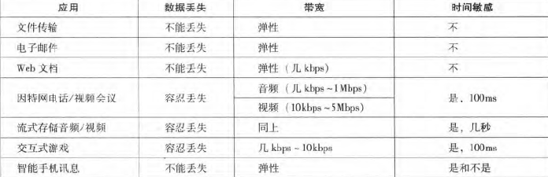
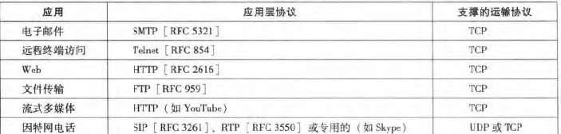
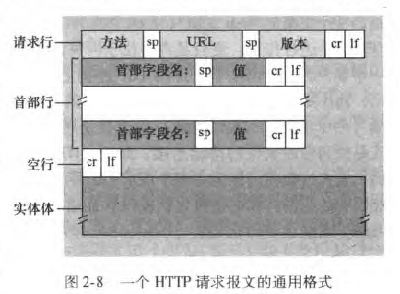
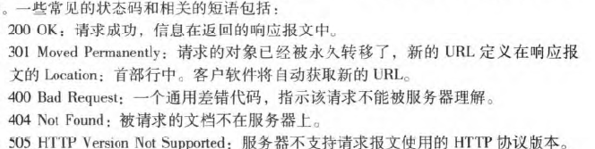

# 计算机网络笔记

## CH1 计算机网络和因特网

### 名词解释

端系统

通信链路	communication link

#### 分组 packet

端系统发送数据时，将数据分段，并给每段加上首部字节，形成的 `<u>`信息包 `</u>`

`<u>a</u>`

#### 分组交换机 packet swtich

从入通信链路接收分组，从出通信链路转发分组

路由器 router

链路层交换机 link-layer switch

#### 路径 route/path

一个分组经过的通信链路和分组交换机

#### 因特网服务提供商 ISP

internet service provider

#### 协议 protocol

#### TCP	传输控制协议

transmission control protocol

#### IP 网际协议

Internet Protocol

定义在发送和接收的分组格式

#### 端系统的连接

端系统通过通信链路和分组交换机连接在一起、

#### 服务描述

##### 分布式应用程序

涉及多个相互交换数据的的端系统的应用程序

##### 套接字接口 socket interface

规定交付数据的方式

#### 协议 Protocol

定义两个或多个通信实体之间交换报文的格式和顺序，以及发送或接受一条报文或其他时间所采取的动作

### 网络边缘

#### 端系统

主机 host

    客户端	client

    服务器  server

#### 接入网

连接到边缘路由器的网络

##### DSL，电缆，拨号，卫星，FTTH

##### wifi，以太网

##### 广域无线：3g，4g

### 网络核心

#### 分组交换

报文 ->分组

##### 存储转发传输

交换机输出分组前必须接受整个分组

端到端时延

N条速率为R的链路（N-1台路由器）传输L比特数据（不考虑节点时延和传播时延

$$
d_{端到端} = N\frac{L}{R}
$$

##### 排队时延和分组丢失

对于每条链路 路由器有输出缓存

准备传输的链路正在传输其他分组，需要将分组储存在输出缓存

输出缓存满时 分组丢失

##### 转发表

路由器用于将目的地址（ip）映射成输出链路

#### 电路交换

### 分组交换网的 时延 丢包 吞吐量

#### 时延类型

##### 节点处理时延

##### 排队时延

a	分组到达速率 	pkt/s

L	分组长度		bits

R	传输速率		bps

La/R	流量强度	用于估计排队时延

La/R>1	比特到达速率小于传输速率	队列趋于无限增加	排队时延趋于无限大

La/R<=1	流量性质影响时延

如果分组周期性到达，不会有排队时延，如果突发形式到达，第一个分组不会有时延，后面的会有较大时延

##### 传输时延

L/R

##### 传播时延

传输链路物理属性

#### 丢包

输出缓存满时，到达的分组没有地方存储，路由器将丢弃该分组

#### 端到端时延

##### Traceroute 命令

查看到达目的地的端到端时延

windows 下为tracert

#### 端到端吞吐量

瞬时吞吐量

平均吞吐量

#### 瓶颈链路

不同链路的传输速率取最小值，防止积压比特

### 协议层次和服务模型

#### 5层因特尔协议栈

物理层	链路层	网络层	运输层	应用层

##### 7层模型 OSI参考模型

物理层	链路层	网络层	运输层	会话层	表示层	应用层

##### 应用层

网络应用程序及应用层协议

HTTP	Web文档请求及传送

SMTP	电子邮件报文传输

FTP		端系统直接文件传输

DNS		端系统名字转换为网络地址

message	报文 应用层的信息分组

##### 运输层

在应用程序端点直接传输 应用层 报文

有两种运输层协议 TCP UDP

segment	报文段	运输层的分组

##### 网络层

将成为数据报的网络层分组从一台主机移动到另一台主机

网络层协议包括网际协议和路由选择协议

IP	网际协议

datagram	数据报	网络层的分组

##### 链路层

在每个节点 网络层将数据报传给链路层，链路层将数据传递给下一个节点，将数据报上传给网络层

链路层的协议例子

以太网

WiFi

DOCSIS

frame	帧	链路层分组

##### 物理层

将帧中的一个个比特在节点间传输

与实际传输媒体相关

#### 封装

## 应用层

### 应用层协议原理

#### 应用程序体系结构

客户-服务器体系

P2P对等体系

#### 进程通信

##### 客户 服务器进程

##### 进程与计算机网络接口

socket	套接字	应用程序通过socket向网络发送报文和接收报文

应用程序对运输层的控制：

    1：选择运输层协议

    2：设定运输层参数

##### 进程寻址

IP地址	标识主机

    32bits

端口号	指定接收进程

    Web服务器	80

    邮件服务器	25

##### 端口号列表

http://www.iana.org

#### 运输服务要求

##### 可靠数据传输

##### 吞吐量

##### 定时

##### 安全性

#### 因特网的运输服务

##### TCP

面向连接服务

可靠数据传输

有拥塞控制

##### UDP

无连接

最小服务

    不保证可靠性，无拥塞控制





### WEB HTTP

web页面由对象组成

    HTML基本文件+引用对象

URL：服务器名+对象路径

web浏览器-客户端

web服务器-服务端	储存web对象

##### 无状态协议

服务器不储存客户的状态信息

#### 持续链接和非持续连接

请求/响应对

持续连接		通过相同的TCP连接发送

非持续连接	通过独立的TCP连接发送

HTTP默认为持续连接

##### RTT 往返时间

分组从客户到服务器再到客户的时间

##### 三次握手

TCP连接的过程

客户向服务器发送小的TCP报文段-服务器用一个小TCP报文段做出确认和响应-客户向服务器返回确认

#### HTTP报文格式

##### HTTP请求报文

每行以回车换行结束，末尾行后再附加一个回车换行

第一行为请求行request line	方法字段+URL字段+HTTP版本字段

其余为首部行	header line



##### HTTP响应报文

状态行+首部行+实体行

状态行status line：	版本+状态码+短语



#### cookie

HTTP是无状态协议

cookie用于识别，追踪用户

##### cookie组件

HTTP响应报文的cookie首部行	Set-cookie：

HTTP请求报文的cookie首部行	cookie:

用户端系统的cookie组件

web站点的后端数据库

#### Web缓存

web缓存器 Web cache	/	代理服务器	proxy

代表初始web服务器满足http请求

配置用户浏览器 使请求首先指向web缓存器，请求过程：

1	浏览器创建到web缓存器的TCP连接，向web缓存器的对象发送一个HTTP请求

2	web缓存器检查，查看是否有该对象副本，如果有，则用HTTP响应报文返回对象

 3	如果没有，则Web缓存器建立初始服务器的TCP连接，发送对该对象的HTTP请求，

4	收到初始服务器的HTTP响应后，Web缓存器在本地储存空间储存一份副本，并向客户浏览器用HTTP响应报文发送该副本

##### 优势

减少一个机构的接入链路到因特网的通信量

#### 条件GET

Web缓存器中的副本可能是陈旧的

If-Modified-Since：	首部行

### 电子邮件

#### 组成

用户代理

邮件服务器

简单邮件传输协议	SMTP	Simple Mail Transfer Protocol

#### SMTP

使用TCP

SMTP客户

SMTP服务端

无中间服务器

#### SMTP与HTTP对比

SMTP:	从邮件服务器到邮件服务器			推协议	7bitASCII码	所有对象放在一个报文

HTTP:	Web服务器到Web客户端(浏览器)		拉协议	无要求		每个对象封装在HTTP响应报文

#### 邮件报文格式

首部后跟一空白行，然后是报文体

##### 首部

必须包含

From：

To：

邮件首部行

#### 邮件访问协议

POP3	port：110

IMAP

基于Web的电子邮件

### DNS 因特网目录服务

Domain Name System

主机名 ip地址转换

DNS：分层DNS服务器实现的分布式数据库，使主机能查询分布式数据库的应用层协议

运行在UDP之上	port：53

#### DNS服务

DNS通常由其他应用层协议如HTTP SMTP FTP使用

解析主机名——》ip地址

```
HTTP做法
1 ) 同一台用户主机上运行着DNS 应用的客户端....
2) 浏览器从上述URL 中抽取出主机名www. son1eschool. edu 、并将这台主机名传给
DNS 应用的客户端。
3) DNS 客户向DNS 服务器发送一个包含主机名的请求。
4) DNS 客户最终会收到一份回答报文，其中含有对应于该主机名的IP 地址。
5 ) 一旦浏览器接收到来自DNS 的该IP 地址，它能够向位千该IP 地址80 端口的
HTTP 服务器进程发起一个TCP 连接。
```

##### 其他DNS服务

主机别名

邮件服务器别名

负载分配

#### DNS工作机理

### 视频流

#### HTTP DASH

#### 内容分发网 CDN

content distribution network‘

#### 套接字编程

##### UDP套接字编程

目的地址：目的主机IP地址+目的套接字端口号

```
from socket import*
serverName = 'hostname'
serverPort= 12000
clientSocket = socket(AF_INET, SOCK_DGRAM)
message= raw_input( ' lnput lowercase sentence :' )
clien 七Socket . sendto(message . encode() , (serverNa.me, serverPort））
modifiedMessage, serverAddress = clientSocket .recvfrom(2048)
print(modifiedMessage . decode ())
clientSocket.close()
```

客户端 - 服务器端

##### TCP套接字编程
